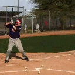
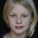
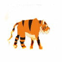

# Unsupervised Keypoint Learning <br/> for Guiding Class-Conditional Video Prediction
An official implementation of the paper "Unsupervised Keypoint Learning for Guiding Class-Conditional Video Prediction", NeurIPS 2019, [[paper](https://arxiv.org/abs/1910.02027)] [[supp](https://arxiv.org/abs/1910.02027)]

<p align="left">
  
</p>


## Requirements

#### Dependencies
- [PyTorch](https://github.com/pytorch/pytorch) 1.0
- [torchfile](https://github.com/bshillingford/python-torchfile)

This is the pre-built [docker image](https://github.com/pytorch/pytorch) that this code can be run on.

#### Dataset
This code is for the Penn Action dataset. This dataset can be downloaded from [here](http://dreamdragon.github.io/PennAction/).

#### Pretrained VGG-Net
For the training, pretrained VGG19 network is needed. It can be downloaded from [here](https://github.com/machrisaa/tensorflow-vgg).


## Train

#### 1. Train the keypoints detector & image translator
```
python train_kd_it.py configs/penn.yaml
```

#### 2. Make pseudo-keypoints labels
```
python make_labels.py configs/penn.yaml
```

#### 3. Train the motion generator
```
python train_mogen.py configs/penn.yaml
```


## Test
```
python eval.py configs/penn.yaml
```


#### Pretrained model
1. [Keypoints Detector & Image Translator](https://github.com/pytorch/pytorch)
2. [Motion Generator](https://github.com/pytorch/pytorch)


## Results

#### Penn Action
<p>
   
   
   
   
   
   
   
   
   
<br>
   
</p>
<p align="center">
   
<br>
   
   &nbsp;&nbsp;
   
   &nbsp;&nbsp;
   
   &nbsp;&nbsp;
   
   
   
   
<br>
   
   &nbsp;&nbsp;
   
   &nbsp;&nbsp;
   
   &nbsp;&nbsp;
   
   
   
   
<br>
   &nbsp;&nbsp;&nbsp;&nbsp;&nbsp;&nbsp;&nbsp;&nbsp;&nbsp;&nbsp;&nbsp;&nbsp;&nbsp;&nbsp;&nbsp;&nbsp;&nbsp;
   &nbsp;&nbsp;&nbsp;&nbsp;&nbsp;&nbsp;&nbsp;&nbsp;&nbsp;&nbsp;&nbsp;&nbsp;&nbsp;&nbsp;&nbsp;&nbsp;&nbsp;
   &nbsp;&nbsp;&nbsp;&nbsp;&nbsp;&nbsp;&nbsp;&nbsp;&nbsp;&nbsp;&nbsp;&nbsp;&nbsp;&nbsp;&nbsp;&nbsp;&nbsp;
   
</p>

#### Nemo-UvA
<p>
   
   
   
   
   
   
   
   
   
</p>

#### MGIF
<p>
   
   
   
   
   
   
   
   
   
</p>


## Related Works
[Villegas et. al.](https://github.com/rubenvillegas/icml2017hierchvid)
[Wichers et. al.](https://github.com/brain-research/long-term-video-prediction-without-supervision)
[Li et. al.](https://github.com/Yijunmaverick/FlowGrounded-VideoPrediction)


## Citation
Please cite our paper when you use this code.
```
@inproceedings{yunji_neurips_2019,
  title={Unsupervised Keypoint Learning for Guiding Class-Conditional Video Prediction},
  author={Kim, Yunji and Nam, Seonghyeon and Cho, In and Kim, Seon Joo},
  booktitle={Advances in Neural Information Processing Systems (NeurIPS)},
  year={2019}
}
```
