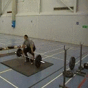

# Unsupervised Keypoint Learning <br/> for Guiding Class-Conditional Video Prediction
An official implementation of the paper "Unsupervised Keypoint Learning for Guiding Class-Conditional Video Prediction", NeurIPS 2019

<p align="left">
  
</p>


## Requirements

- [PyTorch](https://github.com/pytorch/pytorch) 1.0
- [torchfile](https://github.com/bshillingford/python-torchfile)

This is [docker image](https://github.com/pytorch/pytorch).

#### Dataset
1. Download dataset from [here](https://github.com/pytorch/pytorch).
2. Split each video into frames with separated directories.

#### Pretrained VGG-Net
Please download pretrained VGG19 in npy format from [here](https://github.com/machrisaa/tensorflow-vgg).


## Train

#### 1. Train the keypoints detector & image translator
```
python train_kd_it.py configs/penn.yaml
```

#### 2. Make pseudo-keypoints labels
```
python make_labels.py configs/penn.yaml
```

#### 3. Train the motion generator
```
python train_mogen.py configs/penn.yaml
```


## Test
```
python eval.py configs/penn.yaml
```

#### Pretrained model
1. [Keypoints Detector & Image Translator](https://github.com/pytorch/pytorch)
2. [Motion Generator](https://github.com/pytorch/pytorch)


## Results

<p>
   
   
   
   
   
   
   
   
   
</p>


## Citation
Please cite our paper when you use this code.
```
@inproceedings{yunji_neurips_2019,
  title={Unsupervised Keypoint Learning for Guiding Class-Conditional Video Prediction},
  author={Kim, Yunji and Nam, Seonghyeon and Cho, In and Kim, Seon Joo},
  booktitle={Advances in Neural Information Processing Systems (NeurIPS)},
  year={2019}
}
```
