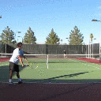
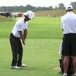
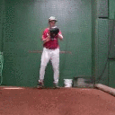

# Unsupervised Keypoint Learning <br/> for Guiding Class-Conditional Video Prediction
An official implementation of the paper "Unsupervised Keypoint Learning for Guiding Class-Conditional Video Prediction", NeurIPS, 2019. [[paper](https://arxiv.org/abs/1910.02027)] [[supp](https://arxiv.org/abs/1910.02027)]

<p align="left">
  
</p>


## I. Requirements

- Linux
- NVIDIA Titan XP
- Tensorflow 1.3.0

#### ※ Dependencies

- Linux
- NVIDIA Titan XP
- Tensorflow 1.3.0

This is the pre-built [docker image](https://github.com/pytorch/pytorch) that can run this code.

#### ※ Dataset
This code is for the Penn Action dataset. The dataset can be downloaded [here](http://dreamdragon.github.io/PennAction/).

#### ※ Pretrained VGG-Net
For the training, pretrained VGG19 network is needed. It can be downloaded [here](https://github.com/machrisaa/tensorflow-vgg).


## II. Train

###### ※※※ Please adjust the paths for inputs and outputs in the configuration file. ※※※

#### 1. Train the keypoints detector & image translator
```
python train_kd_it.py --config_root configs/penn.yaml
```

#### 2. Make pseudo-keypoints labels
```
python make_labels.py --config_root configs/penn.yaml
```

#### 3. Train the motion generator
```
python train_mogen.py --config_root configs/penn.yaml
```


## III. Test
```
python eval.py --config_root configs/penn.yaml
```


#### Pretrained model
1. [Keypoints Detector & Image Translator](https://github.com/pytorch/pytorch)
2. [Motion Generator](https://github.com/pytorch/pytorch)


## IV. Results

###### ※※※ All videos were generated from a single input image. ※※※

#### Penn Action
<p>
   
   
   
   
   
   
   
   
   
<br>
   
</p>

#### UvA-NEMO
<p>
   
   
   
   
   
   
   
   
   
</p>

#### MGIF
<p>
   
   
   
   
   
   
   
   
   
</p>

###### ※※※ Qualitative comparison of the results. ※※※

<p align="center">
   
   &nbsp;&nbsp;&nbsp;&nbsp;
   
   &nbsp;&nbsp;
   
   &nbsp;&nbsp;
   
   &nbsp;&nbsp;
   
   
   
   
<br>
   
   &nbsp;&nbsp;&nbsp;&nbsp;
   
   &nbsp;&nbsp;
   
   &nbsp;&nbsp;
   
   &nbsp;&nbsp;
   
   
   
   
<br>
   
   &nbsp;&nbsp;&nbsp;&nbsp;
   
   &nbsp;&nbsp;
   
   &nbsp;&nbsp;
   
   &nbsp;&nbsp;
   
   
   
   
<br>
   
   &nbsp;&nbsp;&nbsp;&nbsp;
   
   &nbsp;&nbsp;
   
   &nbsp;&nbsp;
   
   &nbsp;&nbsp;
   
   
   
   
<br>
   
   &nbsp;&nbsp;&nbsp;&nbsp;
   
   &nbsp;&nbsp;
   
   &nbsp;&nbsp;
   
   &nbsp;&nbsp;
   
   
   
   
<br>
   
   &nbsp;&nbsp;&nbsp;&nbsp;
   
   &nbsp;&nbsp;
   
   &nbsp;&nbsp;
   
   &nbsp;&nbsp;
   
   
   
   
</p>


## V. Related Works
Unsupervised Learning of Object Landmarks through Conditional Image Generation, Jakab & Gupta et. al., NeurIPS, 2018. [[code](https://github.com/tomasjakab/imm)]<br>
Learning to Generate Long-term Future via Hierarchical Prediction, Villegas et. al., ICML, 2017. [[code](https://github.com/rubenvillegas/icml2017hierchvid)]<br>
Hierarchical Long-term Video Prediction without Supervision, Wichers et. al., ICML, 2018. [[code](https://github.com/brain-research/long-term-video-prediction-without-supervision)]<br>
Flow-Grounded Spatial-Temporal Video Prediction from Still Images, Li et. al., ECCV, 2018. [[code](https://github.com/Yijunmaverick/FlowGrounded-VideoPrediction)]


### ※ Citation
Please cite our paper when you use this code.
```
@inproceedings{yunji_neurips_2019,
  title={Unsupervised Keypoint Learning for Guiding Class-Conditional Video Prediction},
  author={Kim, Yunji and Nam, Seonghyeon and Cho, In and Kim, Seon Joo},
  booktitle={Advances in Neural Information Processing Systems (NeurIPS)},
  year={2019}
}
```
